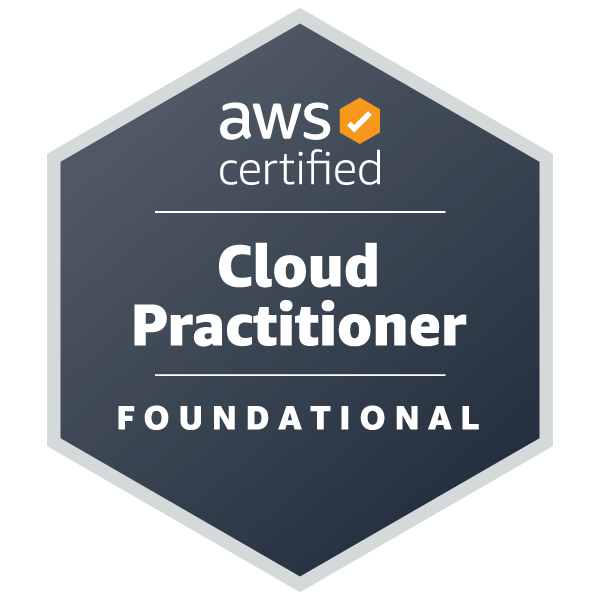
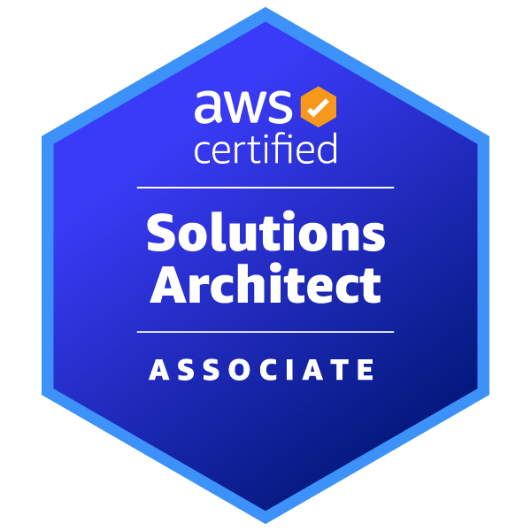
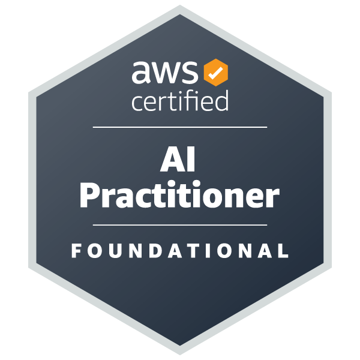
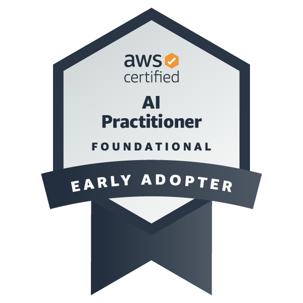

### Hi there 👋

## Stats and MUL

 
  
  

## Certifications

  
  
  
   
  

## Skils (on Work)

 and SQLServer

## Skils (on Student/Private and Hobby)

## Skils (currentry lerning)

<!--
**nekorush14/nekorush14 is a ✨ _special_ ✨ repository because its `README.md` (this file) appears on your GitHub profile.

Here are some ideas to get you started:

- 🔭 I’m currently working on ...
- 🌱 I’m currently learning ...
- 👯 I’m looking to collaborate on ...
- 🤔 I’m looking for help with ...
- 💬 Ask me about ...
- 📫 How to reach me: ...
- 😄 Pronouns: ...
- ⚡ Fun fact: ...
-->
